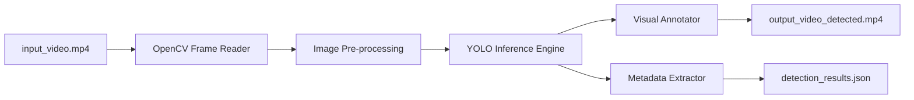
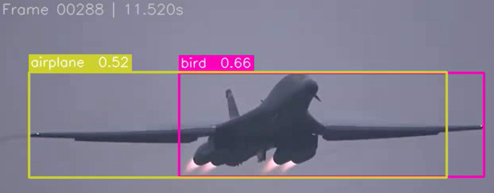
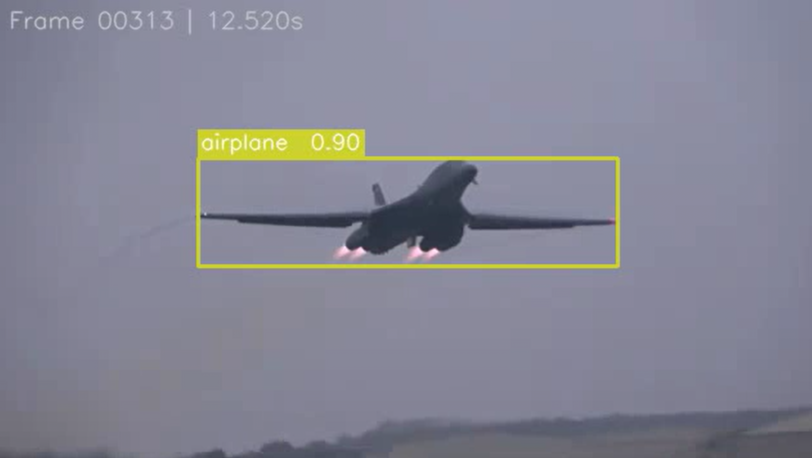
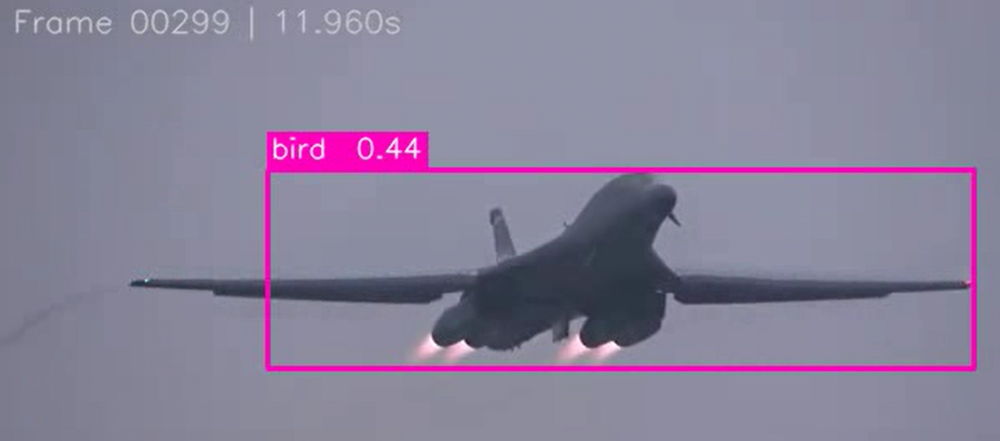
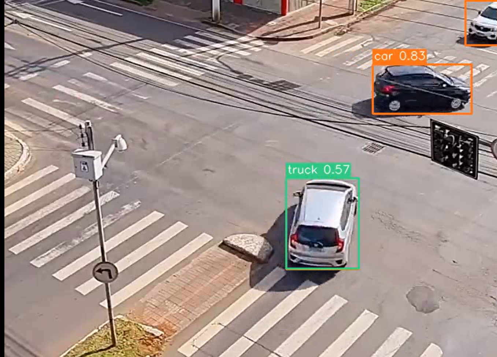
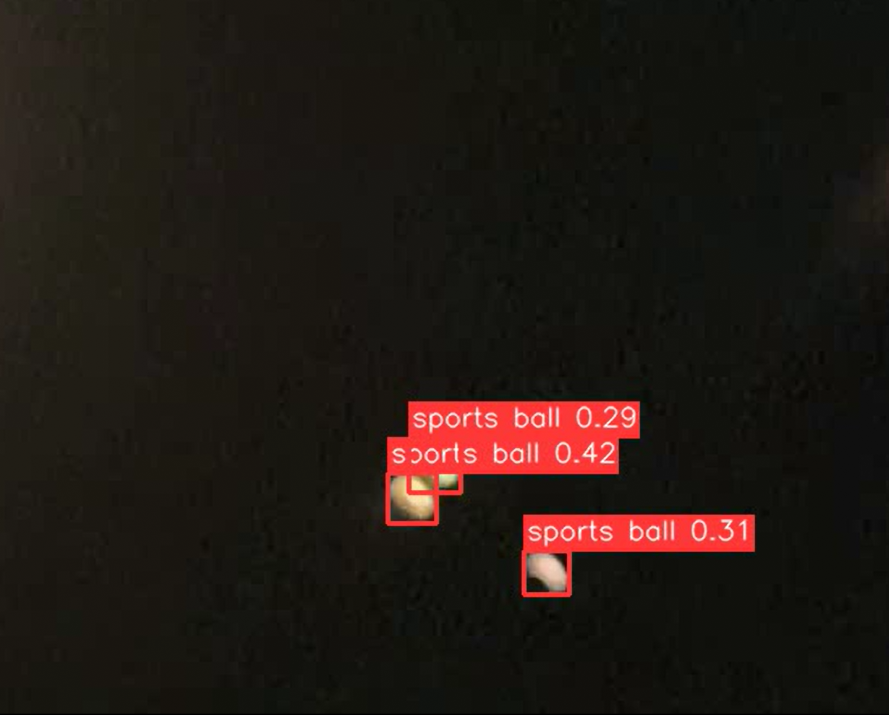

# YOLOv8 Video Object Detection & Metadata Extraction

A modular computer vision pipeline for detecting objects in videos using YOLOv8 (by Ultralytics). This tool processes video frames to produce a visual output with bounding boxes and an exported JSON metadata file containing detailed detection statistics.

## The Core Idea
This project leverages the **Ultralytics YOLOv8** architecture to perform real-time (or near real-time) inference on video streams. By processing each frame sequentially, we can track and record the spatial and temporal properties of detected objects.

1.  **Frame Loop**: Efficiently read video frames using OpenCV.
2.  **Inference Engine**: Use YOLO's optimized model (supporting CPU/GPU) to identify object classes, confidence scores, and bounding boxes.
3.  **Visual Feedback**: Create an annotated video that overlays detection labels.
4.  **Data Export**: Log detections with timestamps and indices into a JSON file for downstream analysis.

## Project Structure
```text
C:\Ai_Expert\L45-Homework\
├── Assets/                 # Source videos and original assets
├── code/                   # Modular Python source code
│   ├── config.py           # Hyperparameters and file paths
│   ├── detector.py         # YOLO model wrapper
│   ├── metadata_handler.py # JSON metadata export logic
│   ├── video_writer.py     # OpenCV video writer management
│   ├── processor.py        # Pipeline orchestration logic
│   ├── main.py             # Application entry point
│   ├── draw_from_json.py   # Utility to redraw boxes from metadata
│   └── yolo_detection.py   # Legacy/standalone detection script
├── metadata/               # Detailed JSON detection results
├── Output/                 # Processed videos and analysis frames
├── requirements.txt        # Python dependencies
└── README.md               # Project guide and analysis
```

## Data Flow / Architecture
The data follows a linear pipeline:



## Results
*Visual proof of detection performance.*


*Example: A frame from the B1B flyover where the model incorrectly labels the aircraft as a bird with low-to-medium confidence.*

### Detailed Visual Analysis Gallery

| Example | Description | Technical Analysis |
|:---:|:---|:---|
| **B1B Lancer** <br>  | High-speed bomber flyover. | Shows the model attempting to lock onto a non-civilian aircraft. The sharp delta-wing profile often confuses COCO-trained feature extractors. |
| **Natural Bird** <br>  | A bird in flight. | Provides a baseline for the B1B misclassification. Note the similar "cross" silhouette and wing positioning that triggers the "bird" class. |
| **Urban Infrastructure** <br>  | Detection of a traffic light. | Demonstrates the model's ability to isolate small, vertical objects against complex backgrounds. These are often difficult due to thin profiles. |
| **High-Density Traffic** <br>  | Busy New York City street. | Showcases the model handling severe occlusion and high object density. It successfully separates overlapping vehicles in a crowded urban grid. |
| **Missile Interception** <br>  | Arrow missile interceptor. | **Misclassification Example:** The model identifies the missile's glowing plume as a **traffic light**. See the Case Study below for a detailed technical root-cause analysis. |

- `output_video_detected.mp4`: The visually annotated video.
- `detection_results.json`: A detailed log of every object detected.

## Analysis of Model Misclassifications

While YOLOv8 is highly accurate, real-world video processing often reveals edge cases where the model fails to correctly classify objects.

### Case Study: Arrow Missile Misidentified as a Traffic Light
In the frame `Arrow.png`, an **Arrow interceptor missile** is labeled as a **traffic light**. This is a rare but logical error based on low-level visual features:

- **Vertical Aspect Ratio**: The missile and its exhaust plume create a long, vertical rectangle. This matches the structural priors for a traffic light pole or housing in the COCO dataset.
- **Chromatic Intensity (Glowing Plume)**: The bright, concentrated light of the rocket motor (yellow/white/red) closely mimics the high-intensity glow of an active traffic signal. Since YOLO looks for local patches of color and light, the "red/orange" glow of the plume triggers the traffic light detector.
- **Background Contrast**: Against a dark night sky or high-altitude atmosphere, the isolated, bright vertical object is statistically more likely to be an urban light source (in the model's training experience) than a supersonic kinetic interceptor, which is a class not present in standard pre-trained models.

### Case Study: B1B Lancer Misidentified as a Bird
In the frame `B1b_bird.png`, we see a **B1B Lancer bomber** being classified as a **bird**. This is a classic example of feature-based misclassification:

- **Morphology (Shape)**: The B1B Lancer is a variable-sweep wing aircraft. When its wings are swept forward or in a neutral position, its silhouette strongly resembles the body-and-wing structure of a large predatory bird.
- **Scale and Perspective**: At lower altitudes or when captured from a side-on perspective, the "sharpness" of the mechanical lines can be softened by **motion blur** or atmospheric haze, making the hard edges of the fuselage look like the softer, organic curves of a wing.
- **Motion Patterns**: Rapid, low-altitude flyovers often mirror the swooping flight paths associated with avian behavior in the COCO training dataset, leading the model's spatial-temporal features to favor a "bird" classification over a "civilian airplane."
- **Lack of Specific Training Data**: Standard YOLO models (trained on COCO) are exposed to thousands of civilian airliners but significantly fewer military-grade strategic bombers with non-traditional "delta" or "variable" geometries.

### Case 2: Car Misidentified as a Truck (or Van)
A standard **car** is frequently mislabeled as a **truck** or **bus**.
- **Scale Ambiguity**: CNNs can struggle with absolute scale. A large SUV close to the camera can trigger the same feature maps as a medium-sized truck further away.
- **Feature Overlap**: Both classes share primary features: wheels, headlights, and windshields. If the rear of the car is occluded or has a boxy design, the model may perceive the "aspect ratio" of the bounding box as more characteristic of a truck.
- **Lighting/Reflections**: Metallic glares on a car’s roof can break up its silhouette, leading the model to interpret the disconnected segments as the larger, flatter surfaces of a commercial vehicle.

## Honest Assessment
### What Worked Well
- **Modularity**: The separation of `detector` and `processor` allows for easy swapping of model versions (e.g., upgrading from YOLOv8 to YOLOv11).
- **YOLOv8 Integration**: The use of the `ultralytics` library provides highly optimized inference and a built-in plotting utility, reducing code complexity.
- **Metadata Precision**: Mapping frame indices to actual timestamps (based on video FPS) ensures data accuracy for external analysis.

### Areas for Improvement (What Didn't Work Perfectly)
- **Real-time Performance**: While efficient, high-resolution videos (4K) on CPU-only machines may suffer from slow processing speeds.
- **Bounding Box Stability**: Without temporal smoothing (e.g., a Kalman filter), boxes might "flicker" slightly between frames for fast-moving objects or low-confidence detections.

## Next Steps (Future Roadmap)
| Feature                | Priority | Description                                                                 |
|------------------------|----------|-----------------------------------------------------------------------------|
| **Temporal Smoothing** | Medium   | Implement an object tracker (like BoT-SORT) to reduce box flickering.        |
| **Multi-GPU Support**  | Low      | Enable parallel processing for high-volume video batches.                   |
| **Filter Results**     | Medium   | Add a config option to only export specific classes (e.g., "car" only).     |

## Setup & Usage

### 1. Create Virtual Environment
**Windows:**
```bash
python -m venv venv
.\venv\Scripts\activate
```

**macOS/Linux:**
```bash
python3 -m venv venv
source venv/bin/activate
```

### 2. Install Requirements
```bash
pip install -r requirements.txt
```

### 3. Run the Script
Ensure you have an `input_video.mp4` in the project root (or change the path in `code/config.py`).
```bash
cd code
python main.py
```

## Dataset
This project uses the pre-trained weights for **YOLOv8** (trained on the **COCO dataset**).
- **Licensing**: AGPL-3.0 for YOLOv8.
- **Source**: [Ultralytics YOLOv8 Documentation](https://docs.ultralytics.com/)
